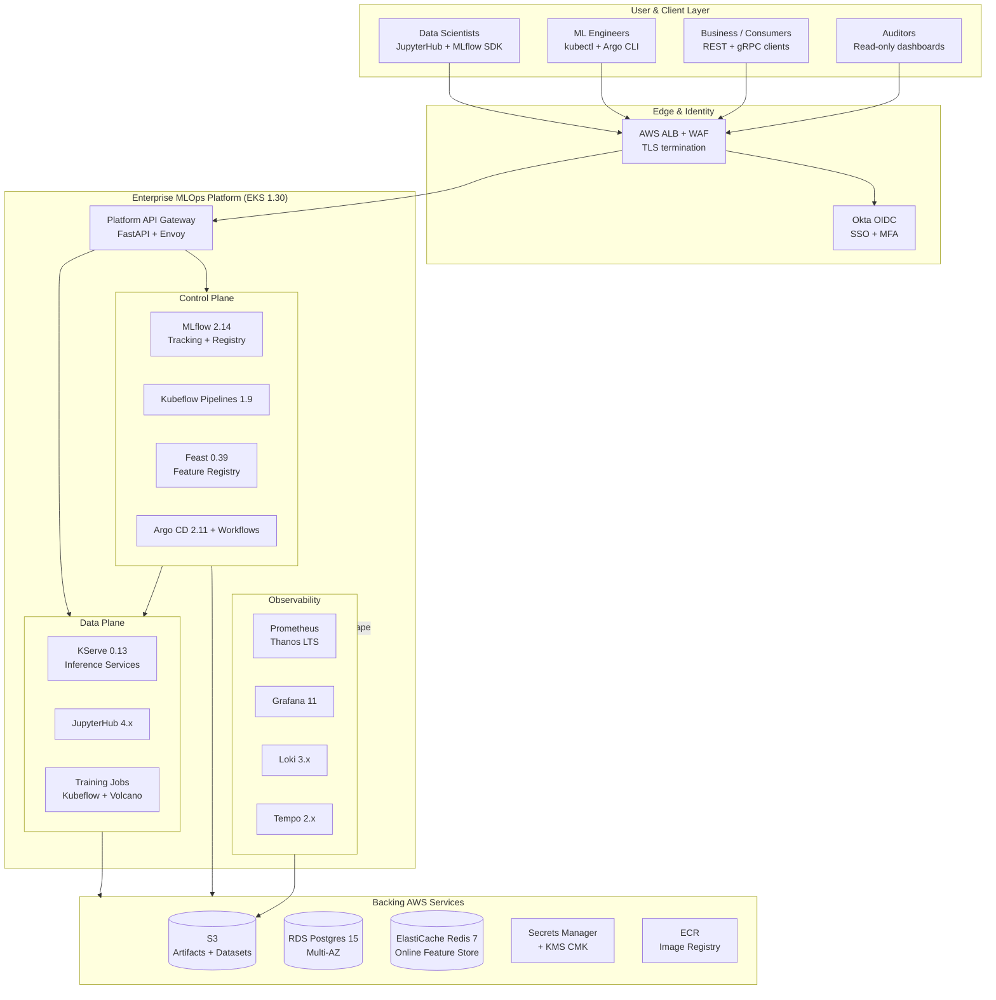
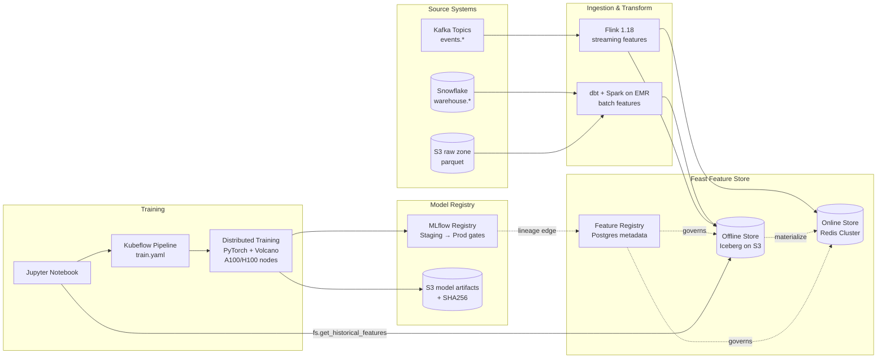
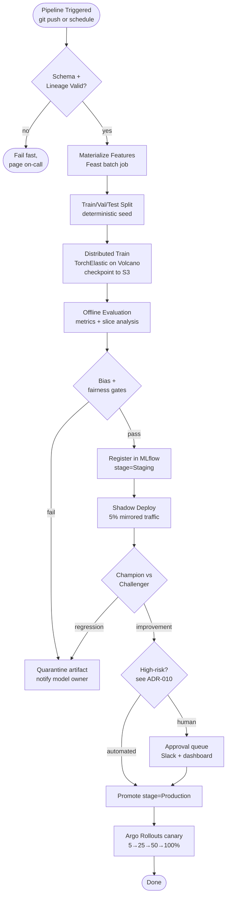
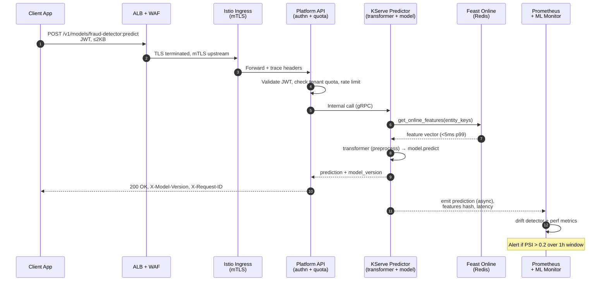
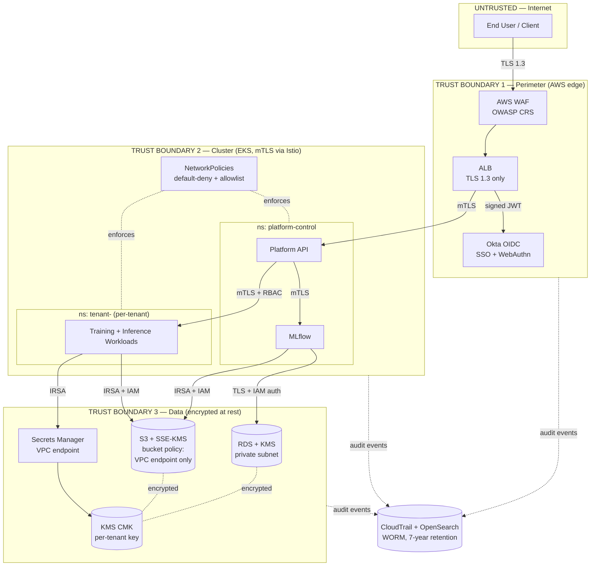

# Architecture Diagrams

This directory is the canonical index of architecture diagrams for the Enterprise
MLOps Platform. Every diagram here is rendered inline in Mermaid so the source of
truth is version-controlled with the rest of the project and reviewable in pull
requests. Static image exports (`.png`, `.svg`) belong in `./exports/` and must be
regenerated from the inline source — never edited directly.

Diagrams are grouped by the architectural concern they address. Each diagram has:
- A **purpose** statement (what question it answers and for whom)
- A **scope** statement (what's in, what's deliberately out)
- A **last-validated** marker (Git commit + date the diagram was last walked
  against the running system or the latest ADR)

For the textual narrative, see [`../../ARCHITECTURE.md`](../../ARCHITECTURE.md).
For the architectural views (logical/process/deployment/physical), see
[`../views/README.md`](../views/README.md). For the decision rationale behind any
boundary drawn below, see [`../adrs/`](../adrs/).

---

## Diagram 1 — High-Level Platform Architecture (C4 Container View)

**Purpose**: Onboarding diagram for a new platform engineer or architect. Shows the
top-level containers, the platform API boundary, and what's hosted inside vs
outside the Kubernetes cluster.

**Scope**: In — control plane, data plane, identity, model serving, observability,
data lake interaction. Out — individual microservices, per-tenant namespaces (see
Diagram 6), specific node groups (see physical view).

**Last validated**: 2026-04 against ADR-001 and ADR-008.

---

## Diagram 2 — Training Data Flow (Source → Feature → Training → Registry)

**Purpose**: Show the lifecycle of a feature value from raw source through
training. Used to explain lineage capture and reproducibility guarantees to
auditors and ML teams.

**Scope**: In — batch and streaming ingestion, materialization, training-time
read, model artifact promotion. Out — inference-time reads (see Diagram 4).

**Last validated**: 2026-04 against ADR-002 (Feast) and ADR-006 (streaming).

---

## Diagram 3 — Training Pipeline (Kubeflow + Argo Workflows Detail)

**Purpose**: Reference diagram for ML engineers building new pipelines. Shows the
canonical step graph, retry boundaries, and which steps are gate-blocked.

**Scope**: In — DAG of a standard supervised-training pipeline. Out — RL or LLM
fine-tuning variants (covered in separate diagrams).

**Last validated**: 2026-03 against `reference-implementations/cicd/model-deployment-pipeline.yaml`.

---

## Diagram 4 — Inference Path (Request → Prediction → Observation)

**Purpose**: Explain the per-request latency budget and the components on the hot
path. Drives SLO conversations and capacity planning.

**Scope**: In — synchronous online inference. Out — async batch scoring (separate
diagram in `./batch-inference.mmd`).

**Last validated**: 2026-04 against KServe deployment manifests.

**Latency budget (p99, end-to-end 80ms)**: ALB 5ms, Envoy 3ms, Gate 7ms,
feature fetch 5ms, model inference 50ms, overhead 10ms.

---

## Diagram 5 — Security Boundaries & Trust Zones

**Purpose**: Compliance and threat-modeling reference. Shows trust zones, where
authn/authz happens, and which links are mTLS vs TLS vs plaintext-on-loopback.

**Scope**: In — perimeter, identity, secrets, mTLS mesh, audit trail. Out —
detailed STRIDE per service (in `governance/audit-procedures.md`).

**Last validated**: 2026-04 against ADR-007.

**Trust transitions and what's enforced at each boundary**:

| Boundary | Authn | Authz | Encryption | Audit Sink |
|---|---|---|---|---|
| 1 → 2 | Okta OIDC (JWT) | Group → RBAC role mapping | TLS 1.3 | CloudTrail + ALB logs |
| 2 → 2 (intra-cluster) | SPIFFE / Istio mTLS | NetworkPolicy + AuthorizationPolicy | mTLS | Istio access logs → Loki |
| 2 → 3 | IRSA (no static keys) | IAM resource policy + SCP | TLS + KMS at rest | CloudTrail + S3 access logs |

---

## Diagram 6 — Multi-Tenancy Namespace Map (informative)

See [`../views/README.md`](../views/README.md) §Logical View for the canonical
tenant namespace map and quota model. It's reproduced there because the view
narrative explains why namespaces are the unit of tenancy (ADR-003).

---

## Conventions

- **Mermaid only**. Do not commit `drawio` or PowerPoint sources.
- One concern per diagram. If a diagram needs more than ~40 nodes, split it.
- **No vendor logos** in diagrams — use text labels with versions.
- **Annotate ADRs**: every non-obvious boundary references the ADR that justifies it.
- **Re-validate quarterly**: walk each diagram against the running system; bump
  the `Last validated` line in the same commit as any drift fix.
