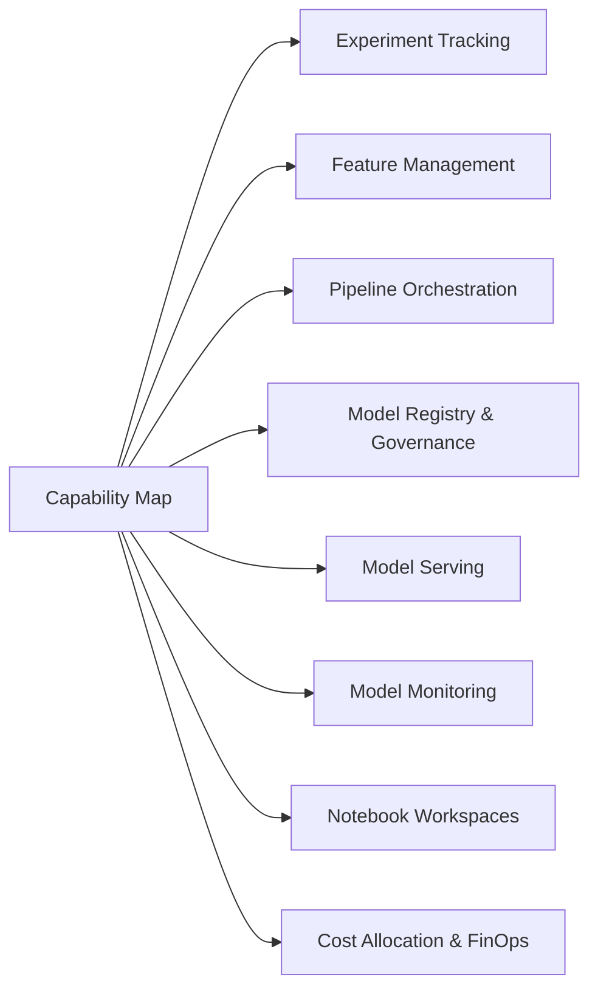
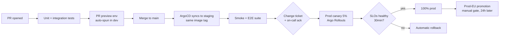
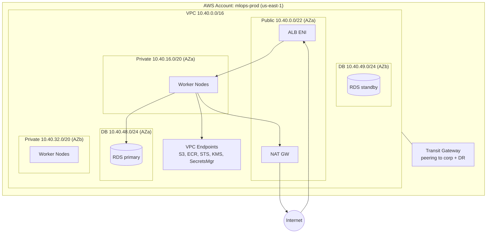

# Architectural Views

This document presents the Enterprise MLOps Platform from four complementary
architectural viewpoints, layered on top of the C4 model (Context → Container →
Component → Code). Each view answers a different stakeholder question and is
maintained independently — when the system changes, expect at least two of these
views to need updating in the same PR.

| View | Primary stakeholder | C4 alignment | Question answered |
|---|---|---|---|
| Logical | Architects, ML engineers | Container + Component | What capabilities exist and how are they decomposed? |
| Process | SREs, platform engineers | Runtime behavior view | How do requests flow at runtime? What runs where? |
| Deployment | Release engineers, SREs | Deployment view | How is the system packaged, promoted, and rolled out? |
| Physical | Infrastructure, FinOps, security | Code + Infrastructure | What hardware/cloud resources are consumed and where? |

Cross-references: [`../diagrams/README.md`](../diagrams/README.md) for the
inline Mermaid renderings, [`../adrs/`](../adrs/) for decision rationale, and
[`../../ARCHITECTURE.md`](../../ARCHITECTURE.md) for the long-form narrative.

---

## 1. Logical View

**Purpose**: Describe the platform's _capabilities_ and their decomposition into
containers and components, independent of how they run at runtime or where they
are physically deployed. This is the view ML engineers and product teams should
read to understand "what the platform does for me."

### 1.1 Capability map

The platform offers eight first-class capabilities. Each is owned by a single
team and exposed via the Platform API.



### 1.2 Container decomposition (C4 Level 2)

The platform is a single bounded system composed of these containers:

| Container | Technology | Responsibility | Owner |
|---|---|---|---|
| Platform API | FastAPI 0.110, Python 3.12 | Single user-facing API surface | Platform team |
| MLflow Tracking + Registry | MLflow 2.14 + RDS Postgres 15 | Experiment runs, model versions | Platform team |
| Feast Feature Server | Feast 0.39, gRPC | Online & offline feature retrieval | Data Platform team |
| Kubeflow Pipelines | KFP 1.9 + Argo Workflows 3.5 | DAG orchestration for training | Platform team |
| KServe Inference Services | KServe 0.13 + Knative | Multi-framework model serving | Platform team |
| JupyterHub | JupyterHub 4.1, KubeSpawner | Notebook environments | Platform team |
| Governance Service | Custom Go service | Approval workflows, audit log | Governance team |
| Observability Stack | Prometheus 2.52, Grafana 11, Loki 3, Tempo 2 | Metrics/logs/traces | SRE team |

### 1.3 Component example — Governance Service

The Governance Service is the most custom container and a good example of
component-level decomposition. It hosts five components:

1. **Approval Workflow Engine** — state machine (Draft → Review → Approved →
   Production) backed by Temporal 1.23.
2. **Policy Evaluator** — OPA / Rego policies for "what triggers human review"
   per ADR-010.
3. **Audit Logger** — append-only writes to PostgreSQL plus stream to OpenSearch
   for SIEM. WORM retention via S3 Object Lock.
4. **Notification Adapter** — Slack, PagerDuty, email through a single
   `Notifier` interface.
5. **MLflow Listener** — consumes MLflow webhooks (`model_version.transition`)
   to trigger approvals automatically.

### 1.4 Tenant model

Logical tenancy is the **team** (≈25 teams, growing to 60 by year 3). Each team
maps to:
- One Kubernetes namespace `tenant-<team>` in the data plane
- One MLflow experiment hierarchy under `/<team>/...`
- One Feast project (`<team>_features`)
- One IAM role + S3 prefix `s3://mlops-data/<team>/`
- One billing dimension (CUR + Kubecost label `tenant=<team>`)

A single user may belong to multiple teams via Okta groups, in which case they
get RBAC roles in each tenant's namespace.

### 1.5 Concrete walk-through: fraud-detector model lifecycle

1. Data scientist on the `risk` team logs into JupyterHub. Their pod is
   scheduled in `tenant-risk`, with read access to `s3://mlops-data/risk/`.
2. They train interactively, logging runs to MLflow under `risk/fraud-detector`.
3. They commit a Kubeflow pipeline definition to `risk-ml-repo`.
4. CI triggers a pipeline run. The pipeline reads features from Feast project
   `risk_features`, trains on a `p4d.24xlarge` node, registers a model version
   in MLflow.
5. The Governance Service receives the MLflow webhook, evaluates OPA policy
   `fraud-detector-promotion.rego`, determines this requires human approval
   (it's PII-handling and financial), and creates a Slack approval request.
6. After approval, an Argo CD ApplicationSet rolls out a KServe
   `InferenceService` in `tenant-risk` with canary 5→100% over 30 minutes.

---

## 2. Process View

**Purpose**: Describe runtime behavior — what processes run, how they
communicate, where threading and concurrency live, and where the failure
domains are. This is the view SREs and platform engineers should read when
planning capacity or debugging an incident.

### 2.1 Process inventory by node pool

| Process | Node pool | Replicas | Concurrency model | Failure domain |
|---|---|---|---|---|
| Platform API | `system-on-demand` (m6i.2xlarge) | 6 (HPA 3–20) | async asyncio, 1 worker / core | Cluster (multi-AZ) |
| MLflow server | `system-on-demand` | 3 | sync gunicorn, 8 workers | Backed by Multi-AZ RDS |
| Feast feature server | `system-on-demand` | 10 (HPA 5–40) | async gRPC, thread pool | Stateless |
| KServe predictor pods | `inference-gpu` or `inference-cpu` | per-model HPA | model-specific (Triton uses TensorRT batching) | Per-model |
| Training jobs | `training-gpu` (p4d/p5) | per-job | Volcano gang scheduling | Per-job |
| Argo Workflow controller | `system-on-demand` | 2 (leader-elected) | event loop | Workflow restart on failover |
| Governance Service | `system-on-demand` | 3 | Temporal worker + HTTP | Stateless workers, Temporal cluster handles state |
| Prometheus | `observability` (m6i.4xlarge) | 2 (HA pair) | scrape every 30s, 1k targets | Thanos sidecar to S3 |

### 2.2 Synchronous request flow (online inference)

Walked in detail in [`../diagrams/README.md`](../diagrams/README.md) Diagram 4.
Key process boundaries:
- **TLS termination** at ALB (managed)
- **mTLS handshake** at Istio ingress gateway (cached per source pod)
- **Authentication** in Platform API: JWT verification is cached for 60s
  per (`sub`, `kid`) tuple to avoid per-request JWKS round-trips
- **Authorization** is two-level: API-level RBAC (can call endpoint), then
  resource-level (can deploy this model)
- **Backpressure**: Platform API uses a per-tenant semaphore (default 1000
  in-flight). Excess returns 429. KServe pods have `concurrency: 0` (unbounded
  on the Knative side) but limited by HPA targeting `concurrency=50`.

### 2.3 Asynchronous flows

| Trigger | Producer | Consumer | Mechanism | At-least-once / exactly-once |
|---|---|---|---|---|
| New experiment run | MLflow webhook | Governance Service | HTTPS, retried | At-least-once (idempotent by `run_id`) |
| Streaming feature update | Flink job | Feast online (Redis) | TCP write | At-least-once (Flink checkpoint) |
| Pipeline step completion | Argo controller | Argo controller | informer cache | At-most-once per controller; durable in etcd |
| Model promotion | Governance Service | Argo CD | Git commit + webhook | Exactly-once via Git ref |
| Drift alert | ML monitor | PagerDuty | Alertmanager → PD webhook | Best-effort, with dedup keys |

### 2.4 Failure domains and recovery

- **Single pod**: HPA + PodDisruptionBudgets ensure ≥N-1 replicas always
  available. Recovery in seconds.
- **Single AZ**: All stateful services run multi-AZ. Quorum-based (RDS Multi-AZ,
  etcd 3-node across AZs, Redis Cluster). Recovery in ~60s.
- **Single region**: Async replication of S3 artifacts and registry DB to a DR
  region. RPO 15min, RTO 4h. DR drill runbook in
  [`../../runbooks/operations-manual.md`](../../runbooks/operations-manual.md).
- **Single tenant**: ResourceQuota + LimitRange prevent one tenant from
  exhausting cluster resources. NetworkPolicy prevents lateral movement.

---

## 3. Deployment View

**Purpose**: Describe how code becomes a running system. This view is for
release engineers, SREs, and anyone debugging "why is the staging cluster on a
different version than prod?"

### 3.1 Environment topology

| Environment | Cluster | Account | Region | Purpose |
|---|---|---|---|---|
| `dev` | EKS `mlops-dev` | `aws-mlops-dev` (123456789012) | us-east-1 | Per-engineer sandboxes, ephemeral PR previews |
| `staging` | EKS `mlops-stg` | `aws-mlops-stg` (234567890123) | us-east-1 | Pre-prod, mirrors prod shape at 25% scale |
| `prod` | EKS `mlops-prod` | `aws-mlops-prod` (345678901234) | us-east-1 (primary), us-west-2 (DR) | Production |
| `prod-eu` | EKS `mlops-prod-eu` | `aws-mlops-prod-eu` (456789012345) | eu-west-1 | EU data residency (GDPR), independent control plane |

Each environment has its own AWS account, its own KMS CMK, its own Okta app,
and its own ArgoCD instance. There are zero cross-account IAM trust
relationships from non-prod into prod.

### 3.2 Promotion model



Images are **immutable** and identified by content digest (`sha256:...`), never
by mutable tag, after the merge step. Argo CD compares manifests to the
deployed state and is the single mechanism that changes production.

### 3.3 Packaging

| Artifact | Format | Built by | Stored in |
|---|---|---|---|
| Platform code | OCI image | GitHub Actions | ECR per env |
| Helm charts | OCI chart | GitHub Actions | ECR `oci://...mlops/charts/` |
| ML model | MLflow model dir + `MLmodel` | Pipeline runner | S3 + MLflow registry |
| Pipeline definitions | Argo Workflow YAML | Source repo | Git (rendered by Argo) |
| Terraform modules | Tarball | Terraform Cloud | Private module registry |

### 3.4 GitOps repository layout

```
mlops-platform-gitops/
  apps/
    dev/        # ApplicationSet per service, image tags = dev-<sha>
    staging/    # Image tags = main-<sha>
    prod/       # Image tags = release-<semver>
  base/         # Kustomize bases, shared across envs
  overlays/     # Per-env patches
```

ArgoCD `ApplicationSet`s generate one `Application` per (service × environment).
Sync waves enforce ordering: CRDs first, then operators, then workloads.

---

## 4. Physical View

**Purpose**: Describe the underlying infrastructure — what hardware, what
cloud resources, what costs. This is the view FinOps, infrastructure
engineering, and security teams should read.

### 4.1 Cloud footprint (per region, prod)

| Resource | Type | Count | Purpose |
|---|---|---|---|
| EKS cluster | 1.30, IPv4 + IPv6 dual stack | 1 | Control plane (AWS-managed) |
| VPC | /16 (10.40.0.0/16) | 1 | 3 AZs, public + private + DB subnets |
| Node pool `system-on-demand` | m6i.2xlarge | 12 (min 6, max 30) | Control containers |
| Node pool `system-spot` | mixed m6i/m6a 2xlarge | 0–50 | Stateless API workloads |
| Node pool `inference-cpu` | c7i.4xlarge | 10–80 | CPU model serving |
| Node pool `inference-gpu` | g6e.xlarge (L40S) | 4–30 | GPU inference (low-latency) |
| Node pool `training-gpu` | p5.48xlarge (H100×8) | 0–16 (Spot+OD mix) | Distributed training |
| Node pool `observability` | r6i.4xlarge | 6 | Prom/Loki/Tempo |
| RDS Postgres | db.r6g.4xlarge, Multi-AZ | 3 instances (MLflow, Governance, Feast registry) | Metadata stores |
| ElastiCache Redis | cache.r7g.xlarge, 6-shard cluster | 1 cluster | Feast online store |
| S3 buckets | — | 6 (data, artifacts, logs, tf-state, dr, audit-worm) | Durable storage |
| KMS keys | Customer-managed, per-purpose | 8 | Encryption |
| ALB | — | 3 (API, Grafana, JupyterHub) | Ingress |
| NAT Gateway | — | 3 (one per AZ) | Egress |

### 4.2 Network topology



### 4.3 Capacity and cost (Year 1, steady state)

| Category | Monthly | Annual | Notes |
|---|---|---|---|
| EC2 (mixed RI 60% / Spot 25% / OD 15%) | $135K | $1.62M | Training Spot saves ~$420K/yr |
| GPU (training H100 + inference L40S) | $180K | $2.16M | Reserved capacity for inference, Spot for training |
| RDS | $14K | $168K | 3 instances, Multi-AZ, 7-day PITR |
| S3 (data + artifacts) | $22K | $264K | IT lifecycle: Standard → IA at 90d → Glacier at 1y |
| ElastiCache | $8K | $96K | 6-shard Redis cluster |
| Data transfer | $12K | $144K | Mostly cross-AZ and to S3 (free via VPC EP) |
| Other (ALB, NAT, KMS, Secrets) | $9K | $108K | |
| **Total** | **$380K** | **$4.56M** | Tracked in Kubecost, allocated by `tenant` label |

### 4.4 Hardware-class rationale

- **H100 (p5.48xlarge)** for training: largest models, NVLink-connected,
  benefits from FP8 + Transformer Engine.
- **L40S (g6e)** for inference: PCIe-attached, half the cost per token of H100
  for ≤70B models, sufficient for batch-1 latency targets.
- **Graviton (r6g) for RDS / r7g for ElastiCache**: ~20% better price/perf than
  Intel for this workload, validated by 30-day comparison on staging.
- **m6i for system pods** instead of Graviton: some operators (older Kubeflow
  components, ADR-008) still lack mature arm64 images.

---

## Maintenance

Each view has a clear owner and a re-validation cadence:

| View | Owner | Re-validate when… |
|---|---|---|
| Logical | Lead architect | New capability added or ADR merged |
| Process | SRE lead | New runtime component or new alert pattern |
| Deployment | Release engineering | Environment change, promotion model change |
| Physical | Infra + FinOps | Quarterly, or major cost/capacity shift |
