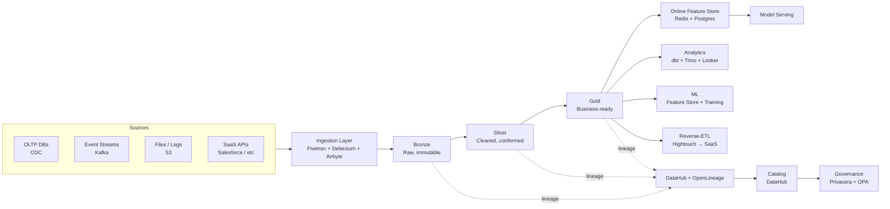

# ARCHITECTURE — Project 304: Enterprise Data Platform

> Reference architecture for an enterprise-scale data platform supporting ML, analytics, and operational reporting. Designed for Fortune-500 scale (10s of teams, 100s of TB/day ingest, multi-region governance).

---

## 1. Context

The data platform is the substrate every other ML capability sits on. If it lags, the entire AI program lags. This architecture targets:

- **10+ business units** producing and consuming data
- **100+ TB/day** of new data (clickstream, transactions, telemetry, logs)
- **Multi-region** governance (US-East, US-West, EU-West-1, AP-Northeast-1)
- **Mixed workloads**: streaming, batch, ad-hoc query, ML training, ML serving
- **Multi-persona**: data engineers, analytics engineers, ML engineers, business analysts, executives

It is opinionated. There are many valid data-platform designs; this one is shaped by the constraint that the same data must support analytics dashboards (latency: minutes) and online ML features (latency: milliseconds) without duplicating the source of truth.

---

## 2. Architectural drivers (ranked)

| Rank | Driver | Why |
|---|---|---|
| 1 | **Single source of truth** | Without it, "the numbers" diverge by team and trust evaporates |
| 2 | **Reproducibility** | A query from 6 months ago must run the same way today |
| 3 | **Governance + audit** | Regulators ask "where did this data come from"; the answer must be machine-generated |
| 4 | **Cost discipline** | Storage + compute are large enough that 20% improvements are tens of $M |
| 5 | **Self-service** | Teams must produce datasets without filing tickets |
| 6 | **Performance** | Sub-second query for serving; minutes for analytics; hours for ML training |

Each architectural choice below is justified against this list.

---

## 3. The high-level shape

Three layers (bronze/silver/gold), one lineage spine, one catalog, one governance plane. Specialized stores (feature store for low-latency serving) sit downstream of gold, never as primary stores.

---

## 4. Layer-by-layer

### 4.1 Ingestion

Three patterns, picked per source type:

| Source pattern | Tool | When |
|---|---|---|
| OLTP CDC | Debezium → Kafka | Source-of-truth tables needing < 1-minute freshness |
| SaaS pull | Fivetran or Airbyte | Off-the-shelf connectors for Salesforce, Stripe, HubSpot, etc. |
| Files / logs | Custom S3 listeners | Logs, file dumps, partner SFTPs |
| Streams | Kafka → Flink/Spark Streaming | High-volume event streams |

**Why three tools, not one:** each pattern has different failure modes. Forcing CDC through Fivetran works but costs 2-3x as much; forcing Salesforce through Debezium doesn't work at all. The cost of three integrations is lower than the cost of square-hole-round-peg engineering.

Pinned versions: Debezium 2.5, Kafka 3.7, Fivetran (managed), Airbyte 0.50, Flink 1.18, Spark 3.5.

### 4.2 Storage — Lakehouse on Delta + Iceberg

**Delta Lake** for the primary lakehouse (Bronze, Silver, Gold). **Iceberg** as a read-only secondary catalog for federated queries from Trino. The duplication is intentional: Delta gives us ACID transactions + time travel for the write path; Iceberg gives us catalog interoperability for federated reads.

| Bucket | Region | Retention | Storage class |
|---|---|---|---|
| Bronze | Per-region | 90 days hot, 7 years archive | S3 Standard → Glacier |
| Silver | Per-region | 18 months hot | S3 Standard |
| Gold | Replicated cross-region | Indefinite | S3 Standard |

**Why per-region for bronze/silver:** data residency. GDPR + India DPDPA + UAE PDPL all require region-confined processing for personal data. Bronze is the legal artifact; we keep it in-region.

**Why replicated for gold:** business-critical datasets need to be queryable from any region for global dashboards. Gold is post-classification and post-PII-stripping, so cross-region replication is legally safe.

### 4.3 Transformation — dbt + Spark

**dbt** for SQL transformations (Silver → Gold, analytics modeling). **Spark** (via Databricks or self-managed EMR) for everything that doesn't fit cleanly in SQL (complex feature engineering, large joins, ML preprocessing).

The split is by team skill, not by capability. SQL teams use dbt; data engineers use Spark. The lineage spine tracks both.

### 4.4 Lineage — OpenLineage + DataHub

Every job (dbt run, Spark job, Airflow task) emits OpenLineage events. DataHub consumes the events and renders the lineage graph. The lineage is column-level where possible (dbt provides it natively; Spark needs the OpenLineage Spark listener).

**Why this matters:** when a regulator asks "which models used PII from the Q3-2024 customer ingest?", we get a queryable answer in DataHub instead of a multi-week archeological dig.

### 4.5 Catalog + Governance — DataHub + Privacera

- **DataHub** is the discovery layer: tables, columns, lineage, owners, freshness, descriptions.
- **Privacera** (or Apache Ranger as an open alternative) enforces row- and column-level access policies based on user attributes (department, region, clearance).
- **OPA Gatekeeper** enforces "data contract" policies at the platform layer: a team cannot publish a table without specifying owner, retention class, PII classification.

The integration: DataHub tags drive Privacera policies. A column tagged `pii.email` in DataHub is automatically restricted by Privacera to roles with the `pii.read` claim. Tagging once enforces everywhere.

### 4.6 Online Feature Store — Feast + Redis + Postgres

For ML serving with low-latency requirements:

- **Offline store**: Delta tables (Gold layer). Materialization jobs (Spark) read from offline → online.
- **Online store**: Redis Cluster for sub-10ms lookups, Postgres for slower batch lookups.
- **Feature serving**: Feast SDK at inference time.

Critical invariant: features defined once, computed offline and online by the same code (via Feast's "feature view" abstraction). This eliminates the training-serving skew that kills most early ML platforms.

---

## 5. Cross-cutting concerns

### 5.1 Data quality

Three layers of checks:

| Layer | Tool | What it catches |
|---|---|---|
| Schema-on-write | Delta schema enforcement | Type errors, missing columns |
| Data-quality tests | Great Expectations / dbt tests | Range violations, null rates, uniqueness |
| Anomaly detection | Monte Carlo / custom Spark jobs | Freshness lag, distribution shift, volume drops |

Failing checks page the data team on-call rotation. Critical failures (e.g., revenue tables) page the responsible team's on-call.

### 5.2 Cost management

- Storage tagged per team via S3 inventory + Athena queries. Monthly cost report to each team.
- Compute tagged per team via Spark labels + Trino query tags. Daily cost dashboard.
- Auto-archiving (Glacier transition) on Bronze data > 90 days old.
- Query optimizer recommendations surfaced weekly (top-10 most-expensive queries with suggested rewrites).

Target: storage cost growth < 80% of data volume growth (i.e., we're getting more efficient over time).

### 5.3 Security

- All buckets encrypted with KMS keys per business unit (BYOK supported for regulated tenants).
- All access logged via S3 access logs + CloudTrail (separate log archive).
- Service accounts use IAM Roles for Service Accounts (IRSA) on EKS; no long-lived credentials.
- Privileged access (read PII) requires JIT elevation via a workflow that logs business justification.

### 5.4 Multi-region

- Each region has its own Delta lake.
- Cross-region replication is policy-driven via Delta Sharing + S3 replication.
- Catalog metadata (DataHub) is multi-region with leader election; clients always see consistent metadata even during failover.

### 5.5 Disaster recovery

- RPO target: 1 hour for Gold, 24 hours for Silver, 7 days for Bronze.
- RTO target: 4 hours to restore query access from a region failure.
- Quarterly DR drills with measured RTO/RPO and published results.

---

## 6. Trade-offs explicitly accepted

| Trade-off | Choice | Why |
|---|---|---|
| Two lakehouse formats (Delta + Iceberg) | Yes | Federated read interop is worth the operational cost |
| Three ingest tools | Yes | Single tool would be 2-3x more expensive at our scale |
| Eventual consistency between regions | Yes (for non-critical analytics) | Synchronous cross-region is too slow and too expensive |
| Online feature store is downstream of Gold | Yes | Single source of truth > single store |
| Self-service publishing requires data contract | Yes | Friction > silent fan-out of bad data |

---

## 7. Alternatives considered and rejected

- **Snowflake-only**: rejected. Vendor lock-in too tight; query cost grows non-linearly; Spark workloads don't fit cleanly.
- **All-Iceberg, no Delta**: rejected. Delta's ACID story is stronger for the write path today; we revisit annually.
- **One ingest tool (Fivetran for everything)**: rejected. Cost would be 3x current; CDC SLA insufficient.
- **No online feature store (compute features at request time)**: rejected. P99 latency budget for inference is 100ms; feature computation from raw data takes seconds.
- **Centralized governance team that approves every dataset**: rejected. Becomes the bottleneck within 12 months; doesn't scale.

---

## 8. Implementation roadmap

| Quarter | Milestone |
|---|---|
| Q1 | Ingestion (Debezium + Fivetran) + Bronze layer operational for 3 pilot teams |
| Q2 | Silver + Gold layers; dbt project structure; DataHub catalog stood up |
| Q3 | OpenLineage spine; Privacera RBAC; first 10 teams migrated |
| Q4 | Online feature store; first 5 ML use cases on the platform |
| Q5-Q6 | Multi-region replication; DR drill program; remaining 20+ teams migrated |
| Q7+ | Optimization (cost, performance, governance maturity) |

---

## 9. Validation criteria

We will know this architecture is succeeding when:

- A new dataset can be published end-to-end (ingest → bronze → silver → gold → cataloged) in < 2 weeks by a self-service team with no platform-team intervention.
- The lineage query "which models consumed table X?" returns a complete answer in < 30 seconds.
- Cost per TB stored decreases by 20% year-over-year.
- 95% of data quality issues are caught by automated checks before downstream consumers notice.
- DR drill RTO ≤ 4 hours (measured, not asserted).

---

## See also

- [README.md](README.md) — project overview
- [Project 301](../project-301-enterprise-mlops/README.md) — the MLOps platform that consumes this data platform
- [Project 305](../project-305-security-framework/README.md) — the security framework layered on top
