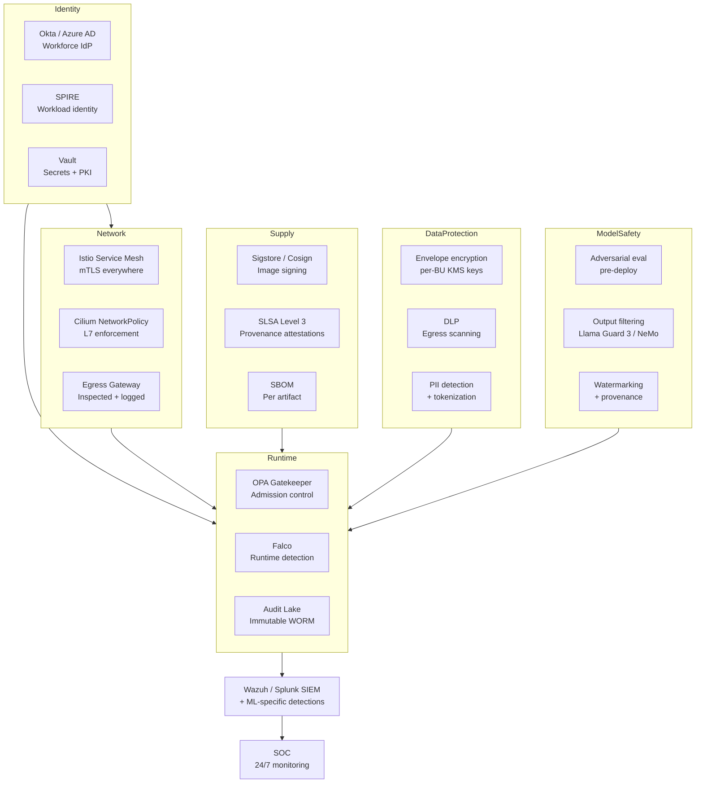

# ARCHITECTURE — Project 305: Enterprise AI Security Framework

> Reference architecture for an enterprise security framework spanning the entire AI/ML lifecycle. Designed to satisfy SOC 2 Type II, ISO 27001, GDPR, HIPAA, FedRAMP Moderate, and SR 11-7 (model risk management for financial institutions) simultaneously.

---

## 1. Context

AI/ML systems present a security surface no single specialty fully covers:

- **AppSec** handles APIs, web vulnerabilities, secrets. Doesn't know what to do with model artifacts.
- **InfoSec** handles data classification, retention, access control. Doesn't know how to threat-model a feature engineering pipeline.
- **AI Safety** (where it exists) handles model behavior, adversarial robustness, content safety. Doesn't speak to network or supply-chain.

This framework's job is to integrate all three into a single coherent posture that:

- Protects training data from theft and tampering
- Protects model artifacts (the model itself is now sensitive IP and a regulated asset)
- Protects the serving path from abuse (jailbreaks, prompt injection, data exfiltration via outputs)
- Provides the audit substrate auditors and regulators expect
- Doesn't slow product teams to a crawl

---

## 2. Architectural drivers (ranked)

| Rank | Driver | Why |
|---|---|---|
| 1 | **Audit-ready by design** | Compliance findings cost more than the engineering to prevent them |
| 2 | **Defense in depth** | Single-control failures must not produce uncontained breach |
| 3 | **Least-privilege everywhere** | Every secret, every role, every endpoint scoped to its actual need |
| 4 | **Continuous verification** | Posture drifts; a one-time hardening is a one-time win |
| 5 | **Velocity preservation** | Security that blocks deployment doesn't get deployed |
| 6 | **Portability** | Cloud-portable security (no AWS-only or GCP-only patterns) |

---

## 3. The high-level shape

Six security domains, one integration point (the runtime control plane), one observability spine (audit lake → SIEM → SOC).

---

## 4. Domain-by-domain

### 4.1 Identity (workforce + workload + secrets)

**Workforce identity** via Okta or Azure AD. SAML/OIDC for SaaS, SCIM for provisioning. MFA required for everything; phishing-resistant MFA (WebAuthn, FIDO2) for privileged roles.

**Workload identity** via SPIRE (SPIFFE Runtime Environment). Every pod, every service, every job gets a cryptographically-attested identity. SPIRE federation lets us cross trust boundaries (multi-cluster, multi-cloud, on-prem ↔ cloud) without long-lived credentials.

**Secrets** via HashiCorp Vault. Static secrets for things that genuinely cannot be dynamic (third-party API keys). Dynamic secrets for everything else (DB credentials, AWS STS tokens, GCP service account tokens, Snowflake user credentials).

**Why Vault over cloud KMS:** portability. Cloud KMS works great for cloud-native services; Vault wraps both cloud KMS and self-managed crypto with a uniform API. Teams migrating between clouds keep using the same Vault namespaces.

### 4.2 Network (zero-trust service mesh + L7 policy)

**Istio service mesh** with strict mTLS enforced across the platform. Sidecar-per-pod model; no in-cluster traffic in plaintext.

**Cilium with NetworkPolicy** as the L4 / L7 enforcement layer. NetworkPolicy default-deny; explicit allows per service. L7 (Cilium HTTP rules) for sensitive paths (e.g., the model registry API only allows GET from serving pods and POST from training pods).

**Egress gateway** for all outbound traffic. Every egress passes through Squid (or commercial equivalent), is inspected for DLP triggers, and is logged. Direct internet access from pods is blocked at NetworkPolicy.

**Why this much network rigor:** the most common ML-platform breach pattern in incident retros is data exfiltration to an attacker-controlled S3 bucket via egress from a compromised training job. Blocking egress at the network layer is the highest-leverage control.

### 4.3 Supply chain (signed images + provenance + SBOM)

**Sigstore Cosign** for image signing. All container images signed at build time; admission control rejects unsigned images.

**SLSA Level 3** for build provenance. Every container has an attached attestation proving (a) it was built by our CI, (b) from a specific commit, (c) with specific dependencies, (d) by a hermetic build.

**Per-artifact SBOM** (Software Bill of Materials) in CycloneDX or SPDX format. SBOMs are queried regularly for CVE matches; a new high-severity CVE in a transitively-included library triggers an automatic ticket to the owning team within 24 hours.

For model artifacts specifically: a "Model Bill of Materials" extends the SBOM concept to include training data sources, training code git ref, base model lineage, evaluation results. Auditors love this.

### 4.4 Runtime (admission control + runtime detection + audit)

**OPA Gatekeeper** for admission control. Policies enforce:

- Only signed images (Cosign verification)
- No root containers
- No host network / host PID / host IPC
- Required labels (owner, cost center, PII classification)
- Resource limits set
- ImagePullPolicy: Always for production namespaces (prevents stale-image escapes)

**Falco** (and/or Tetragon for eBPF detection) for runtime behavior monitoring. Default rules from Falco's CNCF distribution + custom rules for ML-specific behaviors:

- "Training pod reading from a non-training data path"
- "Inference pod writing to local disk"
- "Egress from a model serving pod to an external domain"
- "Sudden spike in egress data volume from any pod"

**Audit lake** — every Kubernetes audit event, every Istio access log, every Vault audit log, every cloud trail event lands in an immutable WORM-storage S3 bucket with Object Lock. Retention 7 years (covers all current regulatory windows). Audit logs in this bucket cannot be deleted, even by the root account.

### 4.5 Data protection (encryption + DLP + PII handling)

**Encryption** in three states:

- **At rest**: AES-256, KMS keys per business unit, customer-managed keys (BYOK) supported for regulated tenants. Key rotation every 365 days enforced.
- **In transit**: TLS 1.3 minimum. Internal traffic via mTLS (Istio). External traffic via cert-manager + Let's Encrypt for non-customer-facing, commercial certs for customer-facing.
- **In use** (for top-tier sensitivity): Confidential Computing via AMD SEV-SNP or Intel TDX. Used for training on highly-sensitive data (healthcare, financial). Not deployed everywhere because it's still slower; deployed where the regulator effectively requires it.

**DLP scanning** on the egress gateway. Pattern-based (regexes for SSN, credit-card, etc.) plus ML-based (custom classifier for PII unique to the org). High-confidence matches block the connection and page on-call.

**PII detection + tokenization** at ingest. Microsoft Presidio (or commercial DLP) classifies columns and tags them in DataHub. Sensitive fields are tokenized via a deterministic-tokenization service (Vault Transit) so they remain joinable but not directly readable.

### 4.6 Model safety (adversarial eval + output filtering + provenance)

**Pre-deploy adversarial evaluation**: every model entering Staging passes through an adversarial test suite:

- Standard adversarial benchmark (e.g., HarmBench, MaliciousInstruct)
- Domain-specific red-team prompts (curated per use case)
- Jailbreak technique panel (DAN variants, indirect injection, multilingual attacks)

A model that exceeds threshold harmful-output rate on the panel is blocked from promotion.

**Output filtering** at serving: Llama Guard 3 (or NeMo Guardrails) for inappropriate content + custom classifiers for business-specific risks (PII leakage, competitive intelligence, financial advice when not licensed to give it).

**Watermarking + provenance**: outputs from generative models are watermarked where the underlying model supports it (e.g., Gemini's SynthID). Output provenance metadata is logged for compliance with EU AI Act Article 50 (transparency obligations).

---

## 5. Cross-cutting concerns

### 5.1 Identity-to-everything chain

The chain that makes the rest work:

1. Engineer authenticates via Okta MFA
2. Vault issues short-lived AWS STS credentials based on Okta group membership
3. Engineer's `kubectl` uses the AWS STS token to authenticate to EKS
4. Pods deployed by the engineer get SPIRE-issued workload identities
5. SPIRE identities are claimed by Vault, Istio, Cilium for downstream auth
6. All actions logged with both the workforce identity (Okta) and workload identity (SPIRE) — full traceability

This chain means a stolen workforce credential gives an attacker time-bounded access; a stolen workload credential is bound to the workload that received it. There are no long-lived "service account" credentials sitting in a YAML file.

### 5.2 Audit completeness

Every relevant event lands in the audit lake. "Relevant" means:

- All authentication events
- All authorization decisions (allow + deny)
- All admin-API mutations
- All secret access (read + rotate)
- All deployments + rollbacks
- All access to PII-tagged data

Auditors can answer "show me every access to dataset X by user Y between dates A and B" in a single Athena query.

### 5.3 Continuous compliance

Daily scans run against the live cluster and emit compliance evidence:

- CIS Kubernetes Benchmark (via kube-bench)
- CIS Docker Benchmark (for image base layers)
- Tenable / Wiz cloud config scans
- Custom OPA policy compliance reports

Drift from compliant state pages the platform-security on-call. Quarterly the evidence package is bundled and handed to external auditors.

### 5.4 Incident response

Designated runbooks per incident class:

- Suspected data exfiltration → quarantine pod, capture forensics, notify legal
- Suspected credential compromise → revoke all credentials issued to the suspected workload, rotate Vault keys
- Suspected adversarial attack on a deployed model → throttle inference, sample outputs for review, page model-owning team
- Suspected supply-chain compromise (e.g., bad image signed) → rollback to last-known-good, notify the build-system team, audit downstream consumers

Runbooks rehearsed quarterly via tabletop exercises with the security team + platform on-call.

---

## 6. Trade-offs explicitly accepted

| Trade-off | Choice | Why |
|---|---|---|
| Sidecar mesh overhead (~10% latency, 5-15% memory) | Yes | mTLS uniformity worth more than a few percent perf |
| Build pipeline complexity (signing + SBOM + SLSA) | Yes | Auditor + supply-chain risk; the work pays back in audits |
| Vault as central dependency | Yes | Single point of failure but operates as HA cluster with rigorous DR |
| Confidential computing only for highest-tier workloads | Yes | Universal CC is too slow + too expensive today |
| Custom Falco rules require maintenance | Yes | Generic rules miss too many ML-specific patterns |

---

## 7. Alternatives considered and rejected

- **Cloud-native security stack (AWS-native: Cognito + Secrets Manager + IAM)**: rejected for portability reasons. Acceptable for AWS-only tenants; not acceptable as the framework default.
- **No service mesh (rely on NetworkPolicy alone)**: rejected. NetworkPolicy can't enforce L7; mTLS not feasible without a mesh or per-app TLS.
- **Hand-rolled image signing (GPG + manifest verification)**: rejected. Sigstore is the de-facto standard; hand-rolled means we maintain it forever and miss the ecosystem.
- **Skip output filtering (trust the model)**: rejected for any generative use case. Foundation models pass standard benchmarks and still emit policy-violating outputs in production.

---

## 8. Implementation roadmap

| Quarter | Milestone |
|---|---|
| Q1 | Identity layer (Okta + Vault + SPIRE) operational; PKI rolled out |
| Q2 | Network mesh (Istio + Cilium) deployed; egress gateway live with DLP |
| Q3 | Supply chain (Cosign + SLSA + SBOM) integrated into CI |
| Q4 | Runtime (OPA Gatekeeper + Falco + audit lake) live in production |
| Q5 | Data protection (KMS BYOK + PII tokenization) for first 5 tenants |
| Q6 | Model safety (eval + output filtering + watermarking) live for first 3 use cases |
| Q7 | First external audit (SOC 2 Type II); audit findings → remediation backlog |
| Q8 | Continuous compliance + SOC integration |

---

## 9. Validation criteria

Success criteria:

- External SOC 2 Type II audit passed with zero high-severity findings
- Mean time to detect a credential compromise ≤ 15 minutes (measured via red-team exercises)
- 100% of production workloads have SPIRE identity (no long-lived service accounts)
- 100% of production images signed (no unsigned-image admission failures)
- Audit lake completeness ≥ 99.9% (measured by reconciliation against source systems)
- Quarterly tabletop exercise completed with all critical runbooks rehearsed
- No security incident with > $100K business impact in any 12-month window

---

## See also

- [README.md](README.md) — project overview
- [Project 301](../project-301-enterprise-mlops/README.md) — the MLOps platform this framework hardens
- [Project 304](../project-304-data-platform/README.md) — the data platform whose data this framework protects
- [Project 302](../project-302-multicloud-infra/README.md) — the multicloud substrate this framework operates across
